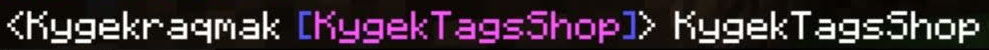

<p align="center">



</p>

<p align="center">


</p>

# 📖 About

**KygekTagsShop** allows players to use tags that they can show to other players by using this plugin.

# 🧩 Features

- EconomyAPI support for tags prices
  - Shows warning if EconomyAPI plugin is not installed or enabled (Can be disabled in `config.yml`)
- Compatible with PureChat
- Unlimited tags
- Forms to buy and sell tags
- Highly customizeable forms
  - Supports `{player}` to display the player name in all forms
  - Supports `&` as formatting codes in all forms
  - Supports `\n` to break new line in all forms
  - Supports `{tagname}` to display tag name and `{tagprice}` to display tag price in some forms
- Command descrption can be changed
- Customizeable message prefix
- Supports command aliases
- Enable/disable return to previous form when the (X) button is pressed
- Automatic plugin updates checker
- Missing config file detection
- Empty tags detection
- Configurable player display name format for tag placement
- Multiple languages support (English, Indonesian, Spanish, German, French, Romanian, Turkish)
- API for developers (see **For Developers** tab)
- Events for developers (`TagBuyEvent` and `TagSellEvent`)

# ⬇️ Installation

- Download the latest version from Poggit Releases (It is recommended to always download the latest version for the best experience, except you're having compatibility issues).
- Place the KygekTagsShop.phar file into the plugins folder.
- Restart or start your server.
- Done!

> If you want to download the latest development build, which may contain the latest features that are currently in development, head over to Poggit CI and download the latest build. Please note that development builds may be unstable because it may contain untested issues or bugs.

# 📜 Commands & Permissions

| Command     | Default Description                                     | Permission           | Default |
| ----------- | ------------------------------------------------------- | -------------------- | ------- |
| `/tagsshop` | Allows player to use KygekTagsShop to buy and sell tags | `kygektagsshop.tags` | true    |

**💡 Tips:**  
- Command description can be changed in `config.yml`. You can also add command aliases in `config.yml`.  
- Use `-kygektagsshop.tags` to blacklist the `/tagsshop` command permission to groups/users in PurePerms.

# ⚙️ For Developers

We provide API for developers to write addons/plugins that depends with KygekTagsShop.
To access KygekTagsShop API class, you can use Kygekraqmak\KygekTagsShop\TagsShop::getAPI().

Example:
```php
$tags = Kygekraqmak\KygekTagsShop\TagsShop::getAPI()->getAllTags(); // Get all tags from KygekTagsShop
```
API code can be seen here.
Please regularly check the changelogs for any changes in the API in future versions.

# ✨ Contributing

Help us by contributing or translating KygekTagsShop plugin. To add translation, fork the KygekTagsShop plugin repo and copy the `en.yml` file inside `resources/lang` directory to the language code.

Don't forget to create a [pull request](https://github.com/thebigcrafter/KygekTagsShop/pulls)!

# ⚖️ License

Licensed under the [GNU General Public License v3.0](https://github.com/thebigcrafter/KygekTagsShop/blob/master/LICENSE) license.
